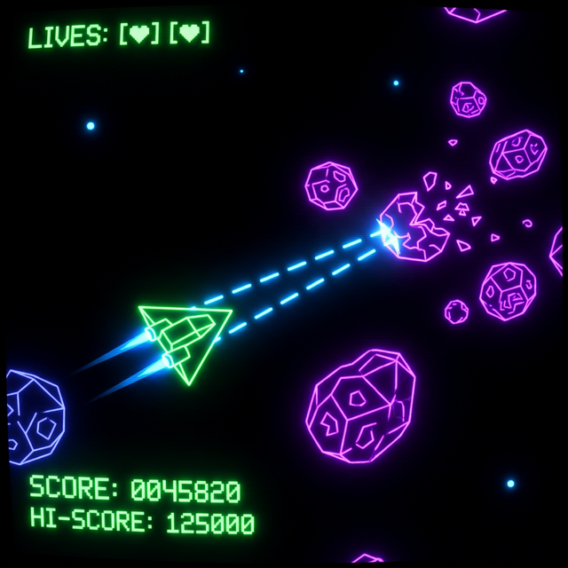

# Asteroids

Asteroids clone written in C3. Software-rendered. Window and input via [RGFW](https://github.com/ColleagueRiley/RGFW). Audio via [miniaudio](https://miniaud.io).

<p align="center">
  <a href="https://manulinares.github.io/c3-asteroids/">
    
    <br>
    <b>🚀 Click here to play in the browser! 🚀</b>
  </a>
</p>

## Dependencies

- [C3 compiler](https://c3-lang.org) (`c3c` in PATH)
- **Linux**: `gcc`, `clang`, `wayland-scanner`, `git`, and dev libraries for X11/Wayland.
- **MacOS**: Xcode Command Line Tools
- **Windows cross-compilation**: `mingw-w64` and MSVC SDK (via `c3c fetch-sdk windows`).
- **Web**: [Emscripten](https://emscripten.org/).

## Build and Run

Before the first build on any platform, you must prepare the C dependencies ([RGFW](https://github.com/ColleagueRiley/RGFW) and [miniaudio](https://miniaud.io)):

### 1. Build Dependencies

Choose your target platform:

```sh
# For Linux
c3c build linux-deps --trust=full

# For macOS
c3c build macos-deps --trust=full

# For Windows (cross-compile from Linux)
c3c build windows-deps --trust=full
```

### 2. Build the Game

```sh
# Linux
c3c run linux

# macOS
c3c run macos

# Windows
c3c build windows

# Web (WASM)
c3c build web --trust=full
# This target handles dependencies and linking in one step.
# Serve the build/ directory using any local web server.
```

## Controls

| Key | Action |
|-----|--------|
| WASD/Arrow Keys | Thrust, Rotate, Brake |
| Space | Fire |
| E | Hyperspace |
| Escape | Quit |
| P | Pause |
| C | Cheat mode |

---
> [!TIP]
> Use `--trust=full` when running/building to allow the `project.json` to execute the dependency build scripts.
